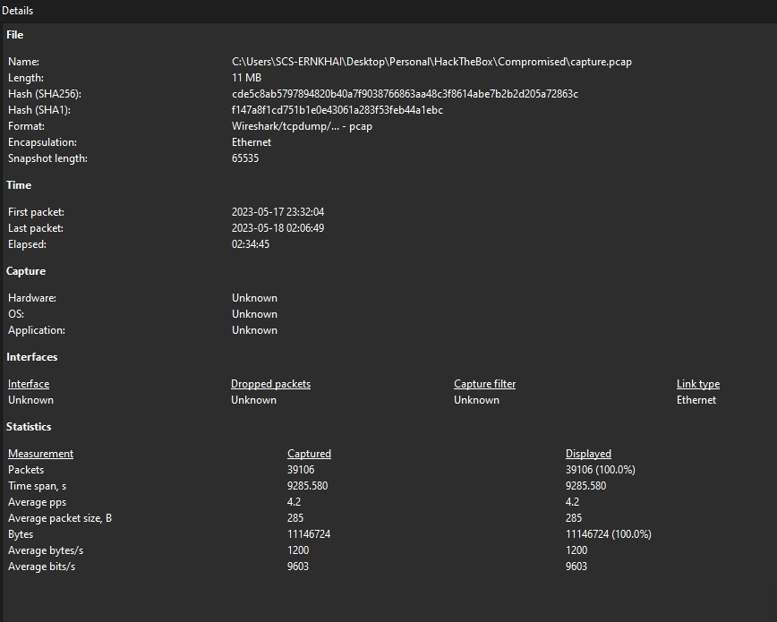
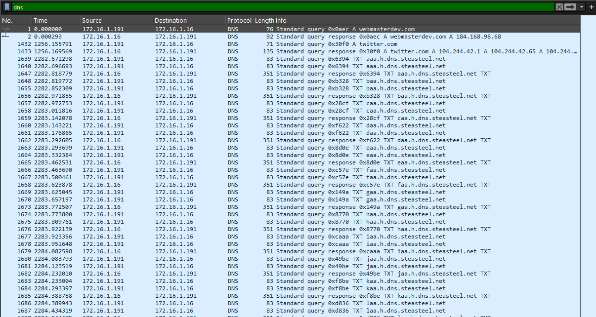

# HackTheBox Sherlocks
## Compromised
by Ernky
---

### Overview of the PCAP file
First things first, I make a habit of checking the statistics of the file just to know what I will be dealing with. 
The first thing I look at is the File Properties tab. 

File size is 11MB.
First packet captured is 2023-05-17 23:32:04
Last packet captured is 2023-05-18 02:06:49
Total packets measured is 39106 packets
Total packets displayed is 39106 packets (100%)

Next, I will look at the Protocol Hierarchy.
I can identify that UDP packets dominate the traffic, which is likely what I should be focusing on analyzing.

### Analysing DNS Query
Now, I would search for all the DNS domains that were captured by filtering out the DNS packets. 

Based on this filter, we can see that the first domain accessed is **webmasterdev.com**.

The results from virustotal showed that this domain is a bit sussy, with 6 vendors flagging it as malicious and malware. Well, we will keep that in mind for now.

### Analysing HTTP Query
Now, I'm gonna focus on the **HTTP** queries in the traffic. Most malwares are downloaded from HTTP requests because it is not a secure protocol to begin with. 
After applying a filter for HTTP queries, we see the first GET request from the IP address **162.252.172.54**.

This IP address, along with the file path **/9GQ5A8/6ctf5JL** seems to be the directory that the victim address is downloading from. 
To further analyse this path, let's follow its TCP streams.

We can see at the header that the content type is an image/gif. However, in the payload, the content type seems to be slightly different. It shows **MZ**, which is the signature of an executable file. Judging by this mismatch in file type and signature, we can identify that this is a **malware** in disguise as an image/gif.
Now we can be certain that this is indeed the malicious file.

### Getting the File Hash
To get the hash from the malware file, first I need to extract the malware. However, due to the constraints of using a work laptop, the anti-virus software cannot be disabled. 
Supposedly, after extraction, use the command **"sha256sum <filename>"** to get the hash values. 
The hash value that is supposed to be generated for that hash file is 9b8ffdc8ba2b2caa485cca56a82b2dcbd251f65fb30bc88f0ac3da6704e4d3c6

### Identifying the Malware
After feeding the hash to VirusTotal, this is the results detected:

It is flagged 60/72 as malicious, and in associations, it is part of a malware family called **Pikabot**.
Further analyzing the results in VirusTotal, we can find in the **Details** section that the virus was first seen in the wild at **2023-05-19 14:01:21** UTC.

### Finding Ports of Self-Signed Certs
To find the HTTPS traffics, you need to display the destination and ports from the ipv4 statistics tab. 
Using the filter "tls" to specify for TLS packets. The reason for filtering only TLS packets is because TLS packets only allow signed packets, which is also what we are trying to search for.

This is what you'll see after applying the filter. The ports are 2222, 2078, and 32999. 

After finding the port, to find the self-signed certificate packet, you have to filter for TLS again. Then find the packets with Certificate type. To determine if a certificate is self signed, you must compare the issuer and subject. If they are by the same organization, then it means they signed the certificate themselves.

From the image, you can see that the issuer and subject are both by **Undelightful**.

And to find the Id-at-localityName, it is listed as shown in the picture, under "RDNSequence item".

The notBefore time(UTC) is also found in the same packet. It is under validity.

### Determining DNS Tunneling Domain
Lastly, we gotta find out the DNS server used by the attacker as a tunnel to transport requests from victim to attacker's computer. The easiest way to determine this is to filter the packets by DNS, and look for queries sent between the same domain multiple times. In this case, a DNS domain named **steasteel.net** is seen to have multiple DNS queries, which might be the C2C server that the attacker is using.

---

Also, remember I said to keep in mind the webmasterdev.com domain? Apparently, it wasn't really doing anything here. It only appeared twice in the whole pcap file. Either that, or I missed something. But anyway, congrats on completing your Box!

