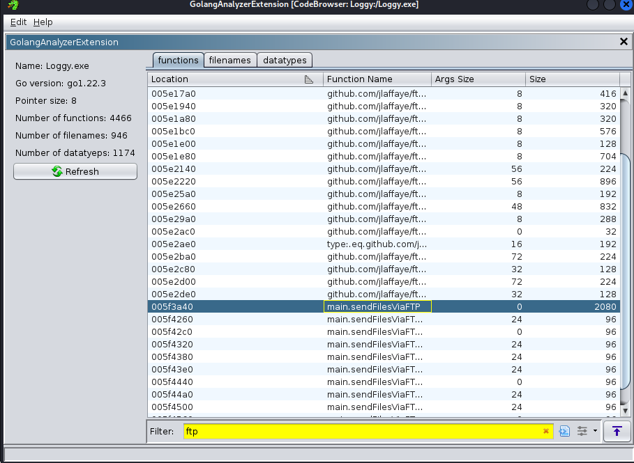

# HackTheBox Sherlocks
## Loggy
by Ernky
---

I'm writing a write-up for this Box because there aren't really any other ones online for those that's struggling to finish this challenge.
The first half of this challenge is possible to do just by using the terminal alone. However, from question 6 onwards is where you need to start using a different tool.
The tools I used for this challenge is Ghidra with the GolangAnalyzerExtension. Here's the link to the GitHub repo to download the extension:
https://github.com/mooncat-greenpy/Ghidra_GolangAnalyzerExtension/releases
The extension is quite important because the malware is written in Go language. Without it, Ghidra doesn't really show you anything. 

### Setting Up Extension for Ghidra
Here I'll show you how to install the extension into Ghidra.

Make sure that you are on the right window for Ghidra. The Ghidra window for your project does not have the "Install Extension" in the File tab. 
I spent too long trying to find that tab for this lol. 
Next, download the correct GolangAnalyzerExtension.zip according to your Ghidra's version, it has to match or else you will encounter problems later on.
After extracting the zip file, go to the Install Extension in Ghidra and select the whole file. Once installed, check the box to run the extension.

### Analysing the Malware
Once you have downloaded all the files from the Box, make sure to read the DANGER.txt file first. Do all the challenges in a VM because you will be handling with an actual malware.
In your linux terminal, unzip the danger.zip file using the 'unzip' command. You will get Loggy.exe, which is the malware. Using the command 'sha256sum <filename>', you will get the hash number of the malware.
**Answer 1: 6acd8a362def62034cbd011e6632ba5120196e2011c83dc6045fcb28b590457c**

Now to read the contents of the malware, use the command 'strings <filename>'. It will display the malware code in strings, which you can use to analyse. For the sake of having more solution options, I will do the first half with terminal and second half with Ghidra.
To know which language the malware is coded in, we need to try and find it in the code. After scrolling through the malware, I manage to spot the word golang, so i knew that the code was written in Go programming language. However, the other way to find it is through grepping keywords like lang. Also, the first half of the challenge is mostly done by guessing keywords using grep lol.
To use the grep command: 'strings <filename> | grep -i <keyword>'. The -i just means case insensitive.

As you can see from the results, you'll get many lines with golang.somethingsomething. You can guess by that that that is the language used (holy shit triple that's, that's my first time writing that that many times)
Anyway, after finding out the language, to search for more information of the language used, just grep using the keyword 'go'.

You'll find the version of the language, which is 1.22.3.
**Answer 2: Golang 1.22.3**

To find out which github is used to exfiltrate data to and from, the first step is to check all githubs used by grepping for 'github' keywords.

There are a few github repos listed as functions here. Let's take a look at all of them. Hashicorp doesn't really look like it has anything to do with exfiltrating data. It looks like its related to the Go language used in the malware.
Next, jlaffaye's repository looks more relatable to the question. Firstly, we see the word ftp which means File Transfer Protocol. Like the name suggests, FTP is responsible for transfering files to and from the host, which is what data exfiltration does. Next, we can also see the word 'ServerConn. This likely means server connection or something. Usually, to exfiltrate data from the victim host, the connection between the attacker and victim has to stay alive. The ServerConn function prolly opens the port and routes the data to the attacker's C2C server or something.
And the nail in the coffin comes from the 'getDataConnPort' and 'openDataConn' functions. These function prolly tries to find the port used to connect to the attacker's computer, and the second function keeps that connection alive.
**Answer 3: github.com/jlaffaye/ftp**

Coincidentally, for the next question asking for github repos that takes 'screenshots', you can already see the screenshot word after jlaffaye's repo.

**Answer 4: github.com/kbinani/screenshot**

And next, to find the function that creates a file after execution, what keyword do you think is important? nope. It's 'File' :)

There are many functions with file in it, and honestly I just tried every one of them until I knew that WriteFile is the correct one. Plus, it's the only one that is actually 9 letters long.
**Answer 5: WriteFile**

This is where the challenge gets slightly harder and also where Ghidra comes into play. I have spent a lot of time trying to find a filter to grep domain names but its so stupidly hard. If you manage to do it, props to you and also please tell me how you did it.
So head over to Ghidra and open the extension window. It will allow you to search for a filter, just type FTP to find anything that uses FTP to exfiltrate data.

Here, you will see some functions that look like they send files using FTP. And also it has the 'main.' path which looks like a domain extension. Double click it to follow it in the code.
Just keep reading the code from there and you'll find on line 74 that it says 'ftp.Dial("gotthem.htb:21"...). The Dial and ftp command is basically a data logger that writes files into an FTP server. And basically whatever comes after that is the domain name, which is gotthem. Man it took me so long to understand why this is what it is. There is only one other write-up in the internet for this Box, but it only gives the answer without much explanations.

**Answer 6: gotthem.htb**

And now to find out the attacker's credentials. Honestly, just keep reading the code a bit more and you will see it because it is also in the same FTP functions anyway. But for the sake of a clearer solution, you can try to search for important keywords like Login. However, you have to search it from the program text search window instead of the extension. 

The username and password is displayed in quotations. 

This is how it'll look like if you use the search function. You can also filter for FTP to narrow down your search.
**Answer 7: NottaHacker:Cle@rtextP@ssword**

The next question is quite easy to guess because based off the files provided, there is another file called keylog. This prolly means that the malware is a key logger and creates a file to log the victim's keystroke. And the obvious answer that the attacker wants to see if the keylog file.
**Answer 8: keylog.txt**

To get Janice's username and password, obviously the way the attacker would've found out is by viewing the keylog file. If you look at the file, they made it really obvious what the username and password is.
**Answer 9: janice:Password123**

The last question asks what Janice's last application was before she ran the screenshot app. From the screenshot clue, you can guess that the malware took a screenshot of her screen when the code was executed. There is another few img files that was provided by the challenge. If you open it up, the only app that is visible in there is the Solitaire app lol. Ig she was really bored to have Solitaire opened cos who tf still plays Solitaire.
**Answer 10: Solitaire**

---

Yippeee, congrats on solving the Box! Another day, another HTB challenge solved. Gud bye.
